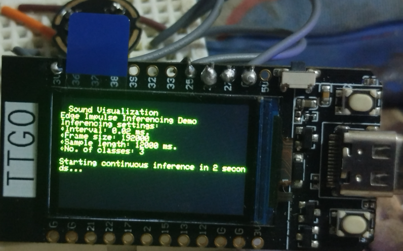

TinyML Audio Classification on ESP32 TTGO T-Display

📌 Project Overview

This project leverages TinyML and Edge Impulse for real-time audio classification on an ESP32 TTGO T-Display with an INMP441 MEMS microphone. The primary goal is to classify important sounds and provide alerts to deaf and hard-of-hearing individuals.

🛠️ Hardware Requirements

ESP32 TTGO T-Display

INMP441 MEMS Microphone

Power Supply (USB-C or Battery)

📦 Software Requirements

Edge Impulse (for model training)

Arduino IDE or PlatformIO

ESP32 Board Package

TensorFlow Lite for Microcontrollers

I2S Library for INMP441 Mic

🚀 Features

Real-time audio classification

Low-power TinyML model optimized for ESP32

Visual & vibrational alerts on detection

Edge Impulse integration for training custom sound models

🔧 Installation & Setup

Clone the repository:

git clone https://github.com/dasigjp/Home-Ear-TinyML_inferencing.git

Install ESP32 Board Package in Arduino IDE (if not installed)

Install necessary libraries

Edge Impulse Inferencing SDK

I2S for ESP32

Adafruit_GFX and TFT_eSPI (for display)

Train your model on Edge Impulse and export as an Arduino library

Upload the model and code to ESP32

📊 Model Training Workflow

Record & collect audio samples

Label and preprocess data on Edge Impulse

Train a TinyML model and optimize it

Deploy the model to ESP32 for real-time inference

📸 Demo & Results

(Include images or GIFs of the working prototype here)

📌 Future Improvements

Support for more sound categories

Cloud integration for real-time alerts

Battery optimization for longer usage

Pull requests are welcome! Feel free to suggest improvements or report issues.

